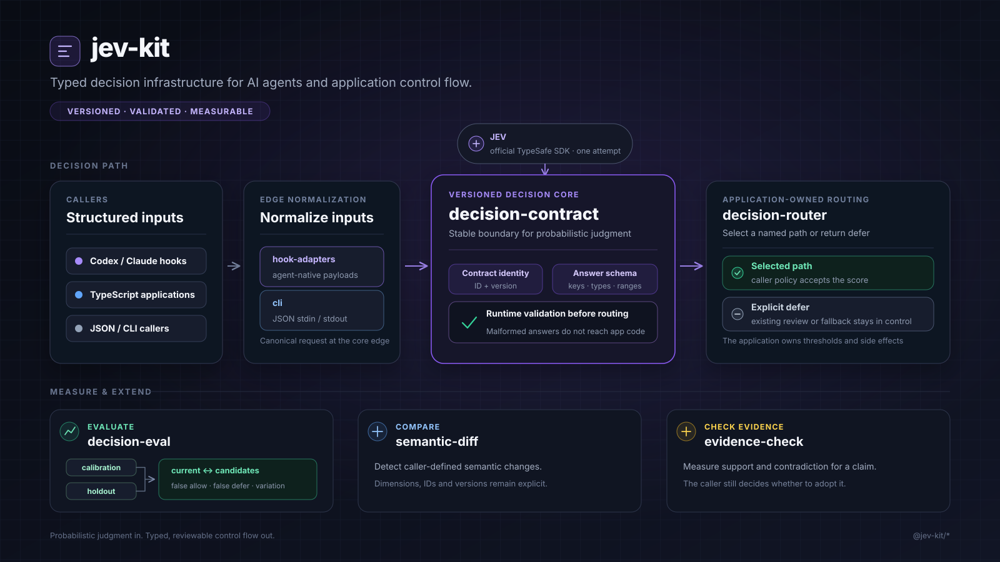

# jev-kit

Make Jev reliable enough to drive application control flow.

Jev can judge a bounded question quickly. The difficult part in a real application is everything around that model call: deciding exactly what context to send, keeping the meaning of a decision stable, rejecting malformed output, separating low confidence from permission, and finding out when a policy blocks the wrong cases.

`jev-kit` provides that missing application boundary. It uses the official `@typesafe-ai/sdk`; it is not another Jev HTTP client.



## What it changes in practice

Consider a common agent integration: decide whether a proposed tool call should proceed.

Passing the complete hook payload to Jev with a single question such as “is this safe?” leaves several different decisions mixed together. The model has to infer the agent's payload format, identify the latest user instruction, interpret the standing policy, recognize unrelated targets and decide what “safe” means. Application code then has to trust that the returned shape and score still mean what the original author intended.

`jev-kit` turns that into an explicit pipeline:

```text
agent-specific hook payload
  → normalize the requested action and actual user context
  → stop recognized credentials before the provider call
  → ask separate, versioned policy questions
  → validate every answer key, type and numeric range
  → apply caller-owned thresholds
  → allow a named path or defer to the existing review system
```

This does not make a probabilistic model infallible. It makes the application's decision more accurate and maintainable by removing work the model should not own, keeping the remaining judgment stable, and exposing false allows and false defers before a policy is changed.

The package solves concrete failure modes:

| Failure in a direct integration | What `jev-kit` owns |
| --- | --- |
| Codex, Claude Code and custom agents send different payload shapes | Adapters normalize them into one review request without flattening the original tool input |
| Credentials can be embedded inside structured tool arguments | A deterministic preflight checks credential-bearing fields, known token formats and credential-file paths before Jev is called |
| One broad prompt mixes authorization, instruction matching and risk | A permission contract measures them as separate questions with explicit thresholds |
| A prompt changes while keeping the same name | Contract fingerprints make changed semantics observable; `assertContractVersioning` rejects reuse of the same ID and version when stored and current identities are compared |
| Missing, extra or out-of-range output reaches control flow | Runtime validation rejects responses that do not exactly match the requested contract |
| Low confidence is accidentally treated as permission or denial | Routing must select a named path or return an explicit defer result |
| A stricter policy looks safer but blocks routine work | Labeled cases identify the exact false-allow and false-defer cases and report their scores and provider usage |

## Why not call Jev directly?

A direct Jev call is sufficient when the result is advisory or consumed immediately. The additional boundary matters when software behavior depends on the result over time.

| Direct model call | `jev-kit` |
| --- | --- |
| A prompt and parsed output are usually coupled to one call site | Questions have a contract ID, version and deterministic content fingerprint |
| Missing, extra or malformed fields can reach application code | Responses are checked against the exact requested keys, answer types and numeric ranges |
| Thresholds and fallback behavior tend to disappear into prompt or glue code | The caller must select a path or defer explicitly |
| A prompt change is difficult to compare with the previous behavior | Labeled fixtures expose false positives and false negatives at caller-owned thresholds |
| Provider retry behavior may be implicit | One library call makes one model attempt; retries are disabled |

The model call is not the differentiator. The differentiator is the durable boundary around it: normalized input, identifiable semantics, runtime conformance, explicit control flow and measurable behavior.

## Packages

| Package | Responsibility |
| --- | --- |
| `@jev-kit/decision-contract` | Define versioned Jev decisions and validate responses against the exact contract |
| `@jev-kit/decision-router` | Route an application to a named path or return an explicit defer reason |
| `@jev-kit/decision-eval` | Measure false positives and false negatives on labeled decision fixtures |
| `@jev-kit/semantic-diff` | Detect caller-defined semantic changes between a baseline and candidate |
| `@jev-kit/evidence-check` | Measure how supplied evidence supports or contradicts an exact claim |
| `@jev-kit/agent-review` | Apply a versioned permission-review policy to a normalized agent tool request |
| `@jev-kit/hook-adapters` | Convert Codex and Claude Code PermissionRequest payloads to and from the normalized protocol |
| `@jev-kit/cli` | Expose agent review, evidence checks and semantic diffs over JSON stdin/stdout |

`decision-contract`, `decision-router` and `decision-eval` are domain-independent. `semantic-diff` and `evidence-check` are reusable contract families, not fixed workflows: callers define their own dimensions, axes, IDs and versions. The built-in contracts are usable defaults and examples of the extension model.

## Agent integration

The adapter layer has one canonical protocol. Agent-specific payloads are normalized before they reach Jev, and Jev results are converted back only at the edge.

```text
Codex PermissionRequest ─┐
Claude PermissionRequest ├─ hook-adapters ─ agent-review ─ decision-contract ─ Jev
custom JSON / Python ────┘                         │
                                                  └─ allow or defer
```

The canonical request and result schemas are published by `@jev-kit/agent-review`:

- `@jev-kit/agent-review/schemas/review-request.json`
- `@jev-kit/agent-review/schemas/review-result.json`

The CLI reads exactly one JSON document from stdin. A normalized caller always receives a normalized result:

```sh
jev-agent-review \
  --adapter normalized \
  --config ./examples/agent-review-policy.json \
  < request.json
```

Codex and Claude Code hook modes emit the native PermissionRequest allow response only when the policy passes. On low scores, sensitive input, missing user context, missing credentials, invalid provider output or provider failure, they emit no decision so the agent's existing review remains in control.

```sh
jev-agent-review \
  --adapter codex-permission \
  --config ./examples/agent-review-policy.json \
  --status-file ~/.codex/hook-state/jev-permission-review/status.json
```

Use `--adapter claude-permission` for Claude Code. API credentials remain environment-owned; the policy file contains no secret. Status aggregation stores the outcome, contract, scores and tool name, never the raw tool input or conversation.

Complete configuration examples are available in [`examples/codex-config.toml`](examples/codex-config.toml) and [`examples/claude-settings.json`](examples/claude-settings.json).

The CLI does not impose an input-length limit or silently retry. `userMessageCount`, when configured, selects how many recent actual user messages the hook adapter supplies and is visible policy rather than a hidden runtime cutoff.

Non-TypeScript callers can use the same contract boundary for evidence checks and semantic diffs:

```sh
jev-kit-evidence-check < evidence-request.json
jev-kit-semantic-diff < diff-request.json
```

These commands measure only the caller-defined axes or dimensions. Thresholds and the resulting application behavior remain owned by the caller.

The sensitive-input preflight walks structured tool input and recognizes credential-bearing fields as well as known token formats and credential-file paths. It is intentionally described as a guard for recognized credentials, not as proof that arbitrary input contains no secret.

## Example

```ts
import { JevClient, defineContract, noul } from "@jev-kit/decision-contract";
import { defer, routeDecision, selectPath } from "@jev-kit/decision-router";

const permissionContract = defineContract({
  id: "my-product.permission-route",
  version: "1",
  questions: {
    matches_read_only_policy: noul("Does this operation only read the stated target?"),
    has_external_side_effect: noul("Can this operation change external state?"),
  },
});

const client = new JevClient({ apiKey: process.env.TYPESAFE_API_KEY! });

const result = await routeDecision({
  evaluate: () => client.evaluate({
    contract: permissionContract,
    state: request,
  }),
  select: ({ answers }) => {
    if (
      answers.matches_read_only_policy.noul >= 0.8
      && answers.has_external_side_effect.noul <= 0.1
    ) {
      return selectPath("read-only-path");
    }
    return defer("policy-threshold-not-met");
  },
});
```

The numeric policy belongs to the application. `jev-kit` does not invent a global confidence cutoff, retry, approval or fallback action.

## Calibrate a contract

```ts
import { evaluateThreshold } from "@jev-kit/decision-eval";

const report = evaluateThreshold([
  { id: "read-list", expected: true, observed: 0.94 },
  { id: "write-update", expected: false, observed: 0.08 },
  { id: "ambiguous-script", expected: false, observed: 0.73 },
], 0.8);

console.log(report.falsePositiveFixtureIds);
console.log(report.falseNegativeFixtureIds);
```

The evaluator reports what a supplied threshold does to known cases. It deliberately does not declare a threshold acceptable; that is product policy.

Permission policies can be measured at their final `allow`/`defer` boundary with `evaluateAgentReviewFixtures`. It reports false-allow and false-defer fixture IDs so a team can compare policy versions on its own labeled requests before changing production routing. See the [calibration workflow](evals/agent-review/README.md) for the fixture format and live evaluation command; replace the example labels with decisions owned by the adopting team.

## Generalization boundary

Use `jev-kit` for repeated, bounded judgments that affect application control flow and can be represented as typed questions. State may be text or arbitrary JSON-compatible data. Contracts can represent routing, triage, semantic change detection, evidence checking, content classification or other domains without changing the runtime.

Do not use it for long-form generation, open-ended research, code generation or tasks where the output itself is the artifact. A normal LLM interface is the correct abstraction for those cases.

## Invariants

- A contract has a nonempty ID, version and question set.
- A contract carries a deterministic SHA-256 fingerprint of its ID, version and question semantics.
- `assertContractVersioning` detects changed semantics when the caller compares stored and current identities that reuse the same ID and version.
- A response must contain exactly the requested answer keys.
- Each answer must match its question type and documented numeric range.
- Choice labels, score legends and probability keys must match the contract.
- `JevClient` disables SDK retries at both client and request level.
- Provider failures become an explicit unavailable result only inside `routeDecision`; unrelated programming errors are rethrown.
- Deterministic authorization, schema validation and side-effect controls remain outside model judgment.

## Development

```sh
pnpm install
pnpm check
pnpm pack:check
```

## Releases

Published packages use Changesets. A pull request that changes a public package includes a changeset describing the affected package, semantic-version bump and consumer-visible change:

```sh
pnpm changeset
```

After changes reach `main`, the release workflow maintains a reviewable version PR. Merging that PR publishes the pending packages to npm through GitHub Actions trusted publishing and records package-specific changelogs and tags. The repository stores no npm publishing token.
